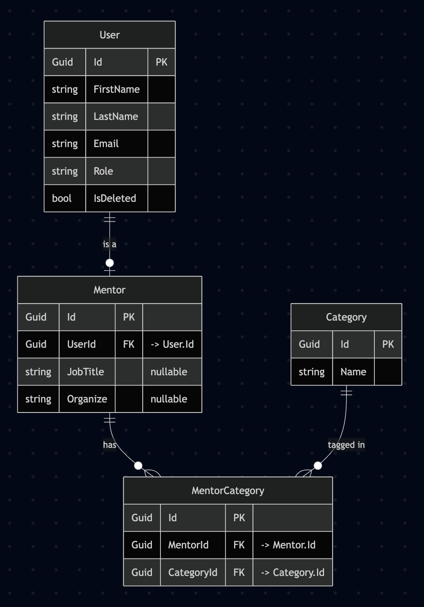

# Yêu cầu hệ thống

## 1. Thiết kế Database

### Bảng User
- `Id` (Guid)
- `FirstName` (string)
- `LastName` (string)
- `Email` (string)
- `Role` (string) — `'user'` hoặc `'mentor'`
- `IsDeleted` (bool)

### Bảng Category (Đã có sẵn)
- `Id` (Guid)
- `Name` (string)

### Bảng Mentor
- `Id` (Guid)
- `UserId` (Guid) — Foreign Key → `User.Id`
- `JobTitle` (string?)
- `Organize` (string?)

### Bảng MentorCategory
- `Id` (Guid)
- `MentorId` (Guid) — Foreign Key → `Mentor.Id`
- `CategoryId` (Guid) — Foreign Key → `Category.Id`

### ERD



#### Quan hệ (Relationships)

| Từ | Đến | Loại | Mô tả |
|------|------|------|-------|
| User → Mentor | one-to-(zero-or-one) | `Mentor.UserId` → `User.Id` | Một user có thể có một hồ sơ mentor |
| Mentor ↔ Category | many-to-many | qua `MentorCategory` | Một mentor thuộc nhiều category, một category có nhiều mentor |

#### Ghi chú

- `Category` là bảng đã có sẵn ("Đã có sẵn"). Các cột (`Id`, `Name`) là giả định — chỉnh lại cho khớp schema thực tế.
- `MentorCategory` là bảng trung gian (join table) cho quan hệ many-to-many giữa `Mentor` và `Category`.
- Nên thêm unique constraint trên `(MentorId, CategoryId)` trong `MentorCategory` để tránh trùng cặp.
- `User.IsDeleted` là cờ soft-delete; mặc định nên lọc `IsDeleted = false`.

---

## 2. Danh sách API

### 2.1. Thêm mới User

- **Endpoint:** `POST /api/users`
- **Request Body:**

```json
{
  "firstName": "string",
  "lastName": "string",
  "email": "string"
}
```

- **Response:** Tạo mới User thành công.

### 2.2. Lấy danh sách User

- **Endpoint:** `GET /api/users`
- **Query Params:**

```json
{
  "page": "int",
  "pageSize": "int",
  "role": "string?",      // 'user' hoặc 'mentor', optional
  "searchTerm": "string?" // optional — tìm theo firstName, lastName hoặc email
}
```

- **Response:** Danh sách User sau khi đã phân trang.

```json
[
  {
    "id": "Guid",
    "firstName": "string",
    "lastName": "string",
    "email": "string",
    "role": "string" // 'user' hoặc 'mentor'
  }
]
```

### 2.3. Thêm mới Mentor

- **Endpoint:** `POST /api/mentors`
- **Request Body:**

```json
{
  "firstName": "string",
  "lastName": "string",
  "email": "string",
  "role": "string",        // 'user' hoặc 'mentor'
  "jobTitle": "string?",   // chỉ có khi role = 'mentor'
  "organize": "string?",   // chỉ có khi role = 'mentor'
  "categories": ["Guid"]   // chỉ có khi role = 'mentor' — mảng Id category mà mentor thuộc về
}
```

- **Response:** Tạo mới Mentor thành công.

### 2.4. Lấy chi tiết một User

- Phục vụ cho cả User và Mentor.
- **Endpoint:** `GET /api/users/{id}`
- **Path Params:** `id` (Guid)
- **Response:** Chi tiết thông tin của User.

```json
{
  "id": "Guid",
  "firstName": "string",
  "lastName": "string",
  "email": "string",
  "role": "string",        // 'user' hoặc 'mentor'
  "jobTitle": "string?",   // chỉ có khi role = 'mentor'
  "organize": "string?",   // chỉ có khi role = 'mentor'
  "categories": ["string"] // chỉ có khi role = 'mentor' — mảng name category mà mentor thuộc về
}
```
